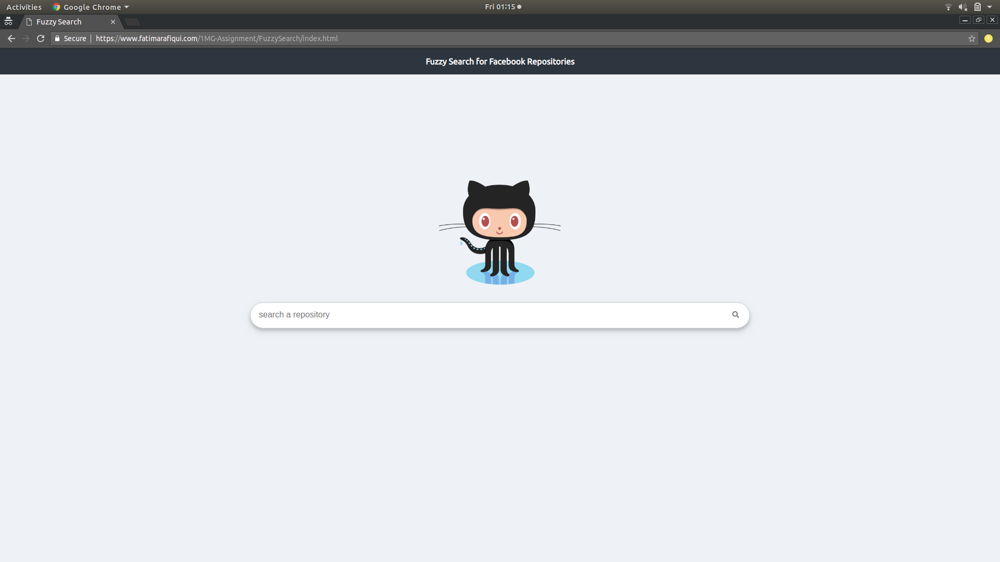

## Demo Links

- [CSS Test Demo](https://fatimarafiqui.com/1MG-Assignment/cssTest/index.html)
  - [x] Create a login form using css and HTML as shown in this link (https://imgur.com/a/mukEbE3#0W93kcC)  -- 10 Points
  - [x] Now add visual signal to form fields, for example if someone has entered wrong entry then show a red outline on input using   css only and now if someone enters correct info the red line should be removed (using CSS only)-- 10 Points
  
  
  - 
  
  
- [Fuzzy Search Demo](https://fatimarafiqui.com/1MG-Assignment/FuzzySearch/index.html)
  - [x] Implement fuzzy search with AJAX. In a search bar if a user types in name of a github repo the search result must show the name of repo which matches the search. (No Jquery or any other library canbe used, pure JS ES6) - 20 Points
  - [x] Extra Point for CSS - 5 Points
  - [x] API: https://api.github.com/users/facebook/repos
   
  
  - 
  
  
- [Github Commits Between Two Tags React-app Demo](https://fatimarafiqui.com/1MG-Assignment/githubSearch/build/index.html)
  - [x] Using create react app create a app which takes inputs as two tags or two commits (Imagine two text field and     a button) and on submit display all the commits along with the picture of commiter and author between those tags or commit     ID's. [Candidate can use css library and any JS library for GET and POST request]--30 Points
  - [ ] Redux Implementation
  - [x] Explore github API
    
  
  - 
  
  
